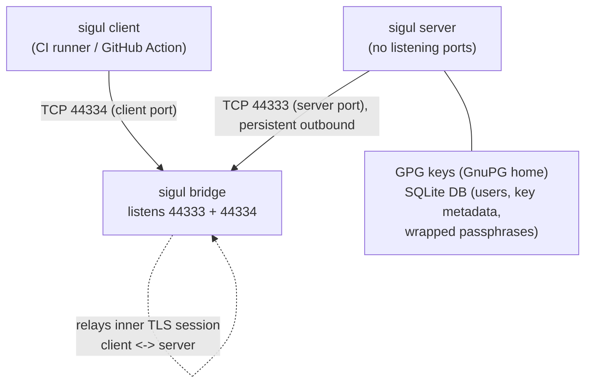
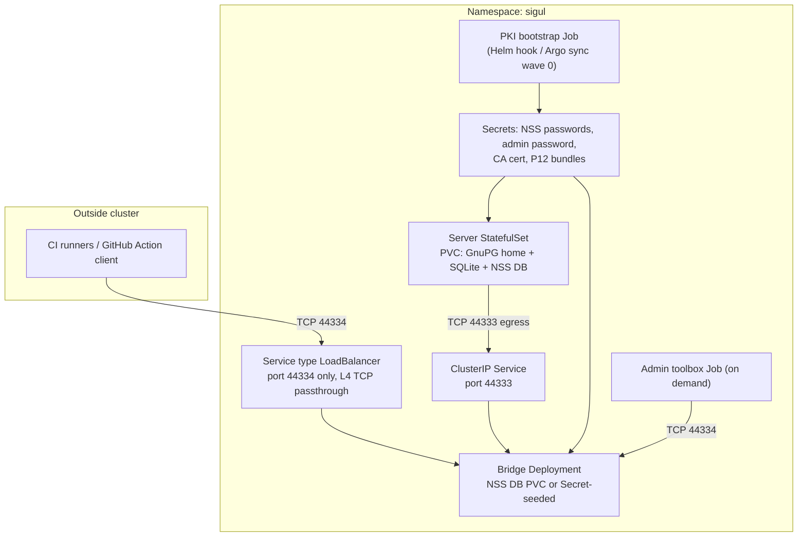

<!--
SPDX-License-Identifier: Apache-2.0
SPDX-FileCopyrightText: 2026 The Linux Foundation
-->

# Sigul on Kubernetes: Evaluation and Migration Proposal

**Status:** Initial evaluation
**Date:** 2026-08-17
**Scope:** Convert the CI/runner-deployed Sigul stack (bridge + server +
client) from Docker Compose into Helm charts suitable for production
Kubernetes deployment, managed by Argo CD.

---

## 1. Executive Summary

The existing stack is already structured in a Kubernetes-friendly way:
an init-container-style `cert-init` one-shot, health-gated startup
ordering, per-component volumes, and role-driven entrypoints. The
migration is therefore largely mechanical, with a handful of genuinely
hard problems:

1. **PKI distribution** currently relies on a shared Docker volume
   (bridge NSS volume mounted read-only into server/client). Kubernetes
   has no good cross-pod shared-volume equivalent; this becomes a
   bootstrap Job writing Kubernetes Secrets.
2. **Signing key protection** — the Sigul server holds GPG private keys
   (GnuPG home) and a SQLite database. These need encrypted,
   backed-up, access-restricted persistent storage.
3. **Root-then-drop-privileges entrypoints** conflict with restricted
   Pod Security Standards and need replacing with `securityContext`
   (`runAsUser`/`fsGroup`).
4. **Two latent defects** discovered during evaluation must be fixed
   regardless: the server SQLite database lands *outside* its persistent
   volume, and the NSS password is written in plaintext to
   world-readable (644) config files and CI logs.

Deployment constraints honoured throughout this document:

- **Sigul's PKI mechanisms stay as-is.** Sigul is built on NSS
  (`cert9.db`/`key4.db`), mutual TLS with a private CA, fixed
  certificate nickname conventions, and a patched double-TLS protocol.
  Deviating from certutil-based PKI generation (e.g., forcing
  cert-manager into the issuance path) is high-risk and not required
  for v1. We containerize the existing, proven `cert-init.sh` flow.
- **Greenfield deployment.** No existing keys, users, or databases need
  importing. First-boot bootstrap (fresh CA, fresh server DB, fresh
  admin user) is the *only* initialization path we must support, which
  removes an entire class of migration complexity.
- **GPG keys are server-side state.** Clients never hold signing keys;
  they hold TLS client certs plus per-user key-access passphrases. All
  long-term secret material concentrates on the server's volume.

---

## 2. Current Architecture (As Evaluated)

### 2.1 Components and connection topology

The bridge is the **only listener** in the system. The server holds a
persistent *outbound* connection to the bridge; clients dial in
per-request. All sessions are mutually-authenticated TLS (NSS,
TLS 1.2+), with an additional nested ("double") TLS session running
client↔server *through* the bridge.



Consequences for Kubernetes:

- Only the **bridge needs a Service** (two ports). The server needs no
  Service at all — it is purely an egress client of the bridge.
- The double-TLS design means **no TLS termination anywhere in the
  path**. Exposure to CI runners must be pure L4 TCP passthrough
  (LoadBalancer/NodePort), never an HTTP(S) ingress or mesh mTLS.
- The bridge hardcodes binding to `0.0.0.0` (no config option), so
  restricting the server-facing port 44333 to the server pod must be
  done with NetworkPolicy.

### 2.2 PKI model

- Single private CA (`sigul-ca`), generated with `certutil` inside the
  bridge's NSS database by the one-shot `cert-init` container. The CA
  private key never leaves that NSS DB.
- Leaf certs for bridge/server/client: RSA 2048, SHA-256,
  `CN=${FQDN}` + one DNS SAN, EKU `serverAuth,clientAuth` (everything
  does mutual TLS), default 10-year validity.
- Distribution: public CA cert + PKCS#12 bundles (server/client) are
  exported into subdirectories of the bridge NSS volume; server and
  client containers mount that volume read-only and import into their
  own NSS DBs at startup (`init-server-certs.sh` /
  `init-client-certs.sh`). The import scripts verify the CA private key
  is *absent* on non-bridge components.
- Known quirks that must be preserved: certificate nicknames must match
  config exactly; `certutil -m` (manual serials) must be avoided
  (broken on some builds); the double-TLS handshake-timing patch
  (`01-fix-double-tls-handshake-timing.patch`) is load-bearing and CI
  verifies its presence in the built image.
- Rotation today is all-or-nothing (`CERT_INIT_MODE=force` regenerates
  the entire PKI and breaks all trust). No graceful renewal exists.

### 2.3 Secrets inventory

| Secret | Generated by | Current storage | Notes |
| --- | --- | --- | --- |
| `NSS_PASSWORD` | deploy script (`/dev/urandom`) | Env var; `.nss-password` files; **plaintext in 644 config files**; **echoed to CI logs**; P12 export password | One shared password for every NSS DB in the stack |
| `SIGUL_ADMIN_PASSWORD` | deploy script | Env var; host artifact file; **echoed to CI logs**; hashed into server DB at first boot | Consumed once by `sigul_server_add_admin` |
| CA private key | `cert-init` | Bridge NSS DB (`key4.db`) | Root of trust; never exported |
| Bridge/server/client TLS keys | `cert-init` | Bridge NSS DB + P12 exports on shared volume | P12 password = `NSS_PASSWORD` |
| GPG signing keys + passphrases | Created at `sigul new-key` time by clients | Server GnuPG home + wrapped (per-user) in server SQLite DB | The crown jewels; nothing in the deploy scripts touches these |
| Client PKI bundle | Packaged manually | GPG-encrypted tar.xz of `.sigul/`, passed to the GitHub Action as a secret | The contract the K8s side must keep producing for CI consumers |

### 2.4 State that must persist

| Data | Path | Criticality |
| --- | --- | --- |
| Server GnuPG home (GPG private keys) | `/var/lib/sigul/server/gnupg` | **Critical — encrypt + back up** |
| Server SQLite DB (users, key metadata, wrapped passphrases) | `/var/lib/sigul/server.sqlite` | **Critical — see defect §3.1** |
| Bridge NSS DB (contains CA private key) | `/etc/pki/sigul/bridge` | Critical (root of trust) |
| Server NSS DB | `/etc/pki/sigul/server` | Reproducible from CA + P12, but persist anyway |
| Generated configs | `/etc/sigul` | Becomes ConfigMap + Secret in K8s |
| Logs, PID files, `/run` | various | Ephemeral (`emptyDir`); logs should go to stdout |

### 2.5 Defects found during evaluation (fix regardless of K8s)

1. **SQLite DB is not on a persistent volume.** Generated `server.conf`
   sets `database-path: /var/lib/sigul/server.sqlite`, but the volume
   mounts at `/var/lib/sigul/server`. The DB lands one level above the
   mount, on the container's writable layer, and is lost on container
   recreation. Invisible in CI (fresh DB every run); fatal in
   production. Fix the path or the mount.
2. **NSS password in world-readable config.** `cert-init.sh` writes
   `nss-password:` in plaintext into 644-mode config files on a volume
   shared between containers, and the deploy script prints both
   passwords to stdout/CI logs. In K8s, configs containing the NSS
   password must be Secret-mounted (0400) and never logged.
3. **Daemon logs are not captured.** Sigul writes
   `/var/log/sigul_{server,bridge}.log` inside the container (CI works
   around this with `docker cp`). Containers should log to
   stdout/stderr for kubectl/cluster log collection.
4. **python-nss-ng install is unpinned by default** in the build
   scripts (Dockerfiles do pin `1.2.2`); the GitHub fallback URL points
   at a personal fork. Pin the version and normalize the repo URL for
   reproducible, attestable images.

### 2.6 python-nss-ng readiness

`python-nss-ng` removes the historical blocker (abandoned `python-nss`
vs. modern NSS/Python). Assessment: production-ready for this purpose.

- Published to PyPI with OIDC trusted publishing + provenance
  attestations; multi-arch (amd64 + arm64) manylinux wheels;
  Python 3.10–3.14.
- **glibc-only** (musllinux wheels explicitly skipped) → Alpine base
  images are out; Fedora/UBI bases are the natural fit (Sigul is
  Fedora-ecosystem software anyway).
- Requires NSS ≥ 3.100 / NSPR ≥ 4.35; images need NSS runtime libs and
  `nss-tools` (`certutil`, needed by Sigul regardless).

---

## 3. What Gets a Helm Chart (Component Disposition)

| Component | In-cluster? | Workload type | Rationale |
| --- | --- | --- | --- |
| **Sigul server** | Yes | StatefulSet, `replicas: 1` | Holds all key material + SQLite; single-writer by design. No Service needed (egress-only). |
| **Sigul bridge** | Yes | Deployment (or StatefulSet), `replicas: 1` | Only listener; needs Service (44333 internal, 44334 exposed). Stateless apart from its NSS DB. |
| **cert/PKI bootstrap** | Yes | Helm hook Job (+ initContainers) | Containerizes the existing `cert-init.sh` flow; writes Secrets instead of shared volumes. |
| **Sigul client** | **No** (confirmed) | Stays a CI-side container / GitHub Action | The client dials into the bridge from outside; `action.yml` already builds/runs it on runners. |
| **Admin client (ops)** | Optional | On-demand Job / `kubectl exec` toolbox pod | Admin operations (new-key, new-user, grant-key-access) need a trusted client with admin credentials; running these as in-cluster Jobs avoids ever shipping admin credentials to CI. |

Your assumption is correct: the client does **not** get a
production Deployment. However, an *admin* client capability is
operationally necessary (key ceremonies, user provisioning), and an
in-cluster Job/toolbox chart is the cleanest way to provide it.

Note on scaling: Sigul's architecture is fundamentally
single-server-instance (SQLite, local GnuPG home, one persistent bridge
connection). Do not attempt HA replicas in v1; use fast rescheduling
(single replica + PVC reattach) and measure recovery time instead.

---

## 4. Proposed Kubernetes Architecture

### 4.1 Resource map



### 4.2 PKI bootstrap: keep certutil, replace the shared volume

Because we keep Sigul's established NSS/certutil mechanisms (per the
constraint above), the bootstrap becomes a **one-time Helm hook Job**
(`pre-install`, or Argo CD sync-wave 0) that runs the existing
`cert-init.sh` logic almost unchanged, with one difference: instead of
leaving exports on a shared volume, it publishes them as Kubernetes
Secrets via the API (the Job's ServiceAccount gets a tightly scoped
Role: create/update named Secrets in its own namespace only):

| Secret | Contents | Mounted by |
| --- | --- | --- |
| `sigul-ca-public` | `ca.crt` (public only) | server-init, admin client, published for CI client bundles |
| `sigul-bridge-nss` | Bridge `cert9.db`/`key4.db`/`pkcs11.txt` seed (contains CA private key) **or** bridge P12 if CA key is kept only on a PVC | bridge |
| `sigul-server-p12` | `server-cert.p12` | server initContainer |
| `sigul-client-p12` | `client-cert.p12` | admin toolbox; source material for the CI client PKI bundle |
| `sigul-nss-passwords` | Per-component NSS passwords (see below) | all components |
| `sigul-admin-password` | Admin account password | server (first boot), admin toolbox |

Each component pod then uses an **initContainer** running the existing
`init-server-certs.sh`-style import: create local NSS DB on the pod's
volume, import CA + own P12, verify nicknames, verify CA private key
absence. This preserves every Sigul PKI quirk (nicknames, sql: DB
format, trust flags, auto serials) while eliminating the cross-pod
shared volume.

Improvements to make while we are here (low-risk, config-level only):

- **Per-component NSS passwords** instead of one shared password. Each
  NSS DB is created fresh at bootstrap, so nothing constrains them to
  be identical. Config files with embedded `nss-password:` are rendered
  by the initContainer from Secret-mounted values into an `emptyDir`
  (mode 0400), never into a ConfigMap.
- **Cert FQDNs = cluster DNS names.** Set `BRIDGE_FQDN` to the bridge
  Service name the *server and clients actually dial* (e.g.
  `sigul-bridge.sigul.svc.cluster.local` internally). Because external
  CI clients connect via a public DNS name, the bridge cert needs
  **multiple SANs** (internal Service name + external FQDN) — a small,
  contained extension to the certutil invocation (`-8` accepts a
  comma-separated list).
- **Shorter validity + documented re-issue runbook.** Keep the CA
  longer-lived (e.g. 10 years) but issue leaf certs for ~2 years, and
  document leaf-only re-issuance (new leaf signed by existing CA,
  rolling restart) so rotation stops being all-or-nothing. This uses
  only existing certutil mechanics — no cert-manager required.

Where the CA private key lives is a policy decision:
**Option A (simpler):** bridge NSS DB (with CA key) seeded into the
bridge PVC by the bootstrap Job; Secrets only carry public material and
P12 leaf bundles. **Option B (more flexible):** CA key kept in a
Secret consumed only by the bootstrap/re-issue Job, and the bridge gets
only its own leaf cert (the bridge does not need CA signing capability
at runtime). Option B is preferred: it decouples cert issuance from
the bridge pod and makes leaf re-issuance a Job re-run.

### 4.3 Server pod design

- **StatefulSet, 1 replica**, `podManagementPolicy: OrderedReady`.
- **PVC** (`volumeClaimTemplates`) mounted at `/var/lib/sigul` —
  covering **both** the GnuPG home *and* the SQLite DB path, fixing
  defect §2.5(1). Separate small PVC (or same volume) for the server
  NSS DB.
- **initContainers:**
  1. `wait-for-bridge` — the existing `nc -z` loop against the bridge
     Service (the entrypoint already contains this logic; it ports
     directly).
  2. `nss-init` — import CA + server P12 into the pod's NSS DB; render
     `server.conf` from Secret values.
  3. `db-init` (first boot only, idempotent) — `sigul_server_create_db`
     - `sigul_server_add_admin` reading the admin password from the
     mounted Secret. Greenfield constraint means this is the only
     bootstrap path needed.
- **securityContext:** `runAsUser: 1000`, `runAsGroup: 1000`,
  `fsGroup: 1000`, `runAsNonRoot: true`, `readOnlyRootFilesystem: true`
  (writable `emptyDir` for `/run`, `/tmp`), all capabilities dropped,
  seccomp `RuntimeDefault`. This **replaces** the root-then-`su`
  entrypoint pattern; the chown logic in the entrypoints is deleted for
  K8s images (`fsGroup` handles volume ownership).
- **Probes:** liveness = exec `pgrep -f sigul_server`; readiness = exec
  checking an established connection to `bridge:44333`
  (`ss -tn state established '( dport = :44333 )'`). No ports to probe.
- **NetworkPolicy:** default-deny; egress only to bridge:44333 + DNS.
  No ingress at all.

### 4.4 Bridge pod design

- **Deployment, 1 replica** (`strategy: Recreate` to avoid two bridges
  fighting over the server connection during rollout).
- NSS DB seeded by initContainer from Secrets (Option B above), stored
  on a small PVC or even recreated into `emptyDir` at each start (fully
  reproducible from Secrets — attractive because then the bridge is
  stateless).
- **Services:** `sigul-bridge` ClusterIP for 44333 (server-facing) and
  a separate LoadBalancer/NodePort Service for 44334 (client-facing),
  L4 only. Restrict 44333 with NetworkPolicy to the server pod, since
  the bridge cannot bind selectively.
- **Probes:** readiness/liveness = `tcpSocket` on 44333 and 44334 with
  a startupProbe allowing ~30 s.
- Same restricted securityContext as the server; the `sudo` install and
  sudoers entry in `Dockerfile.bridge` must be removed for production
  images.

### 4.5 Image changes required

The current images are CI/debug-oriented. For production:

- Build **non-root-native** variants: drop root-start + chown + `su`
  from entrypoints; run as UID 1000 from the start.
- Remove debug tooling (strace, lsof, vim, sudo) from production
  images, or produce a separate slim target; keep `nss-tools`.
- Log to stdout/stderr (defect §2.5(3)).
- Keep the sigul patches — especially the double-TLS handshake fix —
  and keep CI's patch-presence verification.
- Publish multi-arch (amd64/arm64) images to GHCR with digests pinned
  in the Helm values; the release workflow already builds both arches
  natively.
- Pin `python-nss-ng` (already `1.2.2` in Dockerfiles) and normalize
  the install script's fallback repo URL.

---

## 5. Protecting the Signing Keys (Encrypted Storage Analysis)

The server volume holds GPG private keys and the SQLite DB. Defense
should be layered; no single mechanism suffices.

### 5.1 What Sigul already provides (application layer)

Sigul's own design is the strongest layer: GPG private keys in the
GnuPG home are passphrase-protected, and those passphrases are stored
in the server DB **wrapped (encrypted) per authorized user** — the
server cannot use a key without a client presenting the corresponding
key-access passphrase. An attacker with a raw volume copy still faces
passphrase-protected key material. This is why Sigul exists. Storage
encryption below adds defense-in-depth against offline attacks on
weak/brute-forceable passphrases and against metadata exposure.

### 5.2 Storage encryption options, evaluated

| Option | Mechanism | Protects against | Viability |
| --- | --- | --- | --- |
| **A. StorageClass / cloud-native encryption** (EBS/PD/Azure Disk with KMS key, or Ceph RBD / Longhorn encrypted volumes on-prem) | Block-level encryption at rest, keys in cloud KMS or cluster secret | Stolen disks/snapshots, decommissioned hardware, cross-tenant leakage | **Yes — baseline, do this regardless.** Transparent to Sigul; zero app changes. Does *not* protect against a compromised node/kubelet or anyone with pod exec. |
| **B. CSI-level LUKS with external key (e.g. Ceph RBD encryption, Longhorn v2 encryption, or a KMS-backed dm-crypt layer)** | Per-volume LUKS, key released from KMS/Vault at attach time | A + limits blast radius to volumes whose keys are released | **Yes, where the storage platform supports it.** Preferred over A when available; key release can be audited and revoked. |
| **C. In-pod overlay encryption (gocryptfs/fscrypt sidecar or initContainer unlocking an encrypted image on the PVC)** | File-level encryption inside the pod, key from a Secret/Vault at pod start | Storage admins, backup pipeline, anyone reading the PVC out-of-band | Workable but adds FUSE/privilege complexity that fights the restricted security context; moderate operational risk. Recommended **only if** the platform offers neither A nor B with satisfactory key custody. |
| **D. Kubernetes Secrets for key material** | Store GnuPG home in Secrets | — | **No.** Size limits, etcd exposure, no file semantics. (Do enable etcd encryption-at-rest for the Secrets we *do* use: passwords, P12 bundles.) |
| **E. HSM / PKCS#11 (SoftHSM as stepping stone)** | Private keys never on disk in extractable form | Nearly everything, including volume theft with passphrases | The gold standard for signing infrastructure, but **not a v1 item**: Sigul's GnuPG backend does not use NSS/PKCS#11 for GPG keys, so this requires gnupg smartcard/HSM integration work upstream of the chart. Track as a future phase; design the chart so the server volume could later hold only non-extractable key handles. |

**Recommendation:** A/B (platform-level encryption with KMS-managed
keys) as mandatory baseline + Sigul's native passphrase wrapping +
strict access controls (below). Skip C unless the target platform
lacks A/B. Evaluate E as a roadmap item, not a blocker.

### 5.3 Access controls around the volume (as important as encryption)

- Dedicated namespace; RBAC denying `pods/exec` and `secrets` read to
  all but a break-glass role.
- Default-deny NetworkPolicies (server: egress-to-bridge only).
- PodSecurity `restricted` enforced at the namespace level.
- No general-purpose workloads on the same nodes — consider a
  dedicated, tainted node pool for the server; optionally bare-metal or
  confidential-compute nodes.
- Backups (Velero/CSI snapshots) must inherit encryption; backup
  credentials are as sensitive as the volume itself.
- Audit logging on all Secret access and exec in the namespace.

---

## 6. Helm Chart & Argo CD Structure

### 6.1 Chart layout (as implemented)

A **single chart** rather than umbrella + subcharts: the two
components are tightly coupled (one PKI trust domain, shared Secret
contract, shared ports/FQDN values), so subcharts would add value
plumbing without benefit. One release per tenant; the namespace
(tenant-prefixed, e.g. `opensearch-sigul`) comes from the Argo CD
Application destination — the chart is namespace-agnostic.

```text
K8S/
  argocd/
    opensearch-sigul.yaml       # example Application (per tenant)
  charts/sigul/
    Chart.yaml
    values.yaml                 # images (digest-pinned), FQDN, storage
    files/
      conf/                     # bridge/server config templates
      scripts/                  # pki-bootstrap.sh, nss-init.sh,
                                # publish-secrets.py
    templates/
      pki-bootstrap-job.yaml    # + SA/Role/RoleBinding, sync-wave -1
      bridge-deployment.yaml    # wave 1
      bridge-services.yaml      # ClusterIP + external NLB
      server-statefulset.yaml   # wave 2
      networkpolicies.yaml
      storageclass.yaml         # optional Retain-policy gp3+KMS class
      admin-toolbox.yaml        # optional, disabled by default
      configmaps.yaml
```

Per-tenant isolation property: each release mints its **own CA**, so
one tenant's trust domain can never sign a certificate accepted by
another tenant's stack.

### 6.2 Argo CD integration

- **Sync waves:** wave 0 = namespace, RBAC, ExternalSecrets, PKI
  bootstrap Job; wave 1 = bridge; wave 2 = server. The Job is annotated
  `argocd.argoproj.io/hook: Sync` +
  `hook-delete-policy: BeforeHookCreation`, and must be **idempotent**
  (the existing `cert-init.sh` `auto` mode already is: it only
  generates what is missing).
- **Secrets never in Git.** Generated passwords (NSS, admin) should be
  created by the bootstrap Job or sourced via External Secrets
  Operator/Vault — not Helm-templated values. Avoid Helm `lookup`
  tricks; Argo CD renders charts server-side where `lookup` is
  unreliable.
- **Self-heal caution:** the server is stateful and single-replica;
  configure the Application with `prune: false` on PVCs and
  `Retain` reclaim policy on the server StorageClass. A mis-sync must
  never delete the key volume.
- **Image updates by digest** via PR-driven values bumps (not image
  automation controllers) — changes to a signing system should be
  human-reviewed.

### 6.3 CI client contract (unchanged)

The GitHub Action continues to consume: `client.conf` body, key
passphrase, and the GPG-encrypted tar.xz PKI bundle. The K8s side must
provide a documented procedure (admin toolbox Job) that produces this
bundle from the `sigul-client-p12` + CA Secrets — this is the handoff
artifact from platform team to CI consumers. Because this is a clean
deployment, client identities/keys are provisioned fresh via
`new-user` / `new-key` / `grant-key-access` key ceremonies (runbook
required).

---

## 7. Target Platform Survey: `project-shared` EKS Cluster

Surveyed 2026-08-17 (read-only) via the `project-shared-cluster`
kube-context (account `837749700030`, us-west-2, role
`lfit-sysadmins-mfa`). The cluster is ~6 days old — a fresh platform
build-out.

| Aspect | Finding | Implication for Sigul charts |
| --- | --- | --- |
| Kubernetes | EKS `v1.36.2-eks`, **EKS Auto Mode** (Karpenter node pools, built-in LB controller, no self-managed addons in kube-system) | Current APIs; node autoscaling is automatic |
| Node pools | `system` (amd64+arm64, tainted `CriticalAddonsOnly`, c6g.large) and `general-purpose` (**amd64 only**, c6a.large) | Workloads land on amd64. Multi-arch images still built, but amd64 is the runtime target. A dedicated tainted pool for the server (§5.3) would be a new Karpenter NodePool — platform-team request |
| Storage | Default SC `auto-ebs-sc`: **gp3, `encrypted: "true"`** (EBS CSI via Auto Mode), `reclaimPolicy: Delete`, expansion allowed. EFS CSI driver present, no EFS SC | §5.2 Option A satisfied out of the box. **Define a dedicated `sigul-server-sc`**: gp3, `encrypted: true`, a customer-managed KMS key (`kmsKeyId`), and **`reclaimPolicy: Retain`** — the default Delete policy is unacceptable for the key volume (§6.2 guardrails) |
| Load balancing | Traefik (default IngressClass) behind an internet-facing **NLB** provisioned by Auto Mode's built-in controller via standard `service.beta.kubernetes.io/aws-load-balancer-*` annotations; no separate AWS LBC deployment | Bridge:44334 gets its **own dedicated NLB Service** (L4 TCP, `nlb-target-type: ip`) rather than sharing Traefik — double-TLS forbids L7 anyway, and an internal-scheme NLB should be the default posture (§7 Q2 below) |
| GitOps | Argo CD **v3.4.4** in `platform-argocd`, ApplicationSet controller present, **zero Applications defined yet** | Greenfield GitOps — we define the app-of-apps pattern from §6.2 without legacy constraints |
| Certificates | cert-manager with `letsencrypt-prod`/`staging` ClusterIssuers | For public endpoints only; **not** used for Sigul's internal NSS PKI (consistent with §4.2 decision) |
| DNS | external-dns in `platform-external-dns` | Bridge external DNS name can be managed via Service annotation once the FQDN is chosen (Q3) |
| Secrets tooling | **No** External Secrets Operator, sealed-secrets, or Vault CRDs | §6.2: v1 uses bootstrap-Job-generated Secrets; ESO/Vault becomes an optional later integration |
| Secrets at rest | **KMS envelope encryption enabled** for `secrets` (CMK `aec7f21d-2e38-4894-ba4f-d570285aae34`, verified via `describe-cluster` 2026-08-17) | Kubernetes Secrets (P12 bundles, NSS/admin passwords) are KMS-encrypted in etcd — §4.2's Secret-based PKI distribution is acceptable |
| API endpoint | Public endpoint enabled, `publicAccessCidrs: 0.0.0.0/0` | Platform-level observation (not a chart concern); flag to the platform team — a signing system justifies tightening CIDRs or private endpoint access |
| Network policy | `applicationnetworkpolicies.networking.k8s.aws` CRD (Auto Mode NP support) | Standard `NetworkPolicy` resources are enforceable — §4.3/§4.4 policies work |
| Pod Security | No PSA labels on existing namespaces | Set `pod-security.kubernetes.io/enforce: restricted` on the `sigul` namespace ourselves |

**Net effect on the design:** no changes to the architecture in §4–§6;
the platform confirms it. Open questions 1 and 3 are resolved; 2 and 4
narrow to policy decisions (below).

---

## 8. Open Questions

1. ~~**Target platform**~~ — **Resolved:** EKS Auto Mode
   (`project-shared`, us-west-2). Encrypted gp3 is the default; we add
   a Retain-policy StorageClass with a CMK for the server volume.
2. ~~**External exposure policy**~~ — **Decided: internet-facing.**
   GitHub-hosted (public) runners will perform signing, so bridge:44334
   gets an internet-facing NLB. Compensating controls, since source-IP
   restriction is impractical for GitHub-hosted runners (wide, shifting
   ranges published at `api.github.com/meta`):
   - The **double-TLS mutual certificate authentication is the primary
     gate** — connections without a CA-issued client cert fail at the
     outer TLS handshake; the private CA never signs certs for
     anything but provisioned clients.
   - Expose **only** TCP 44334 (44333 stays ClusterIP-internal).
   - NLB is plain TCP (no access logs at L4) — enable **VPC Flow
     Logs** on the NLB subnets and alert on connection-rate anomalies;
     monitor bridge logs for repeated failed handshakes.
   - Revisit source restriction if signing moves to self-hosted
     runners with stable egress IPs.
3. ~~**Secret backend**~~ — **Resolved for v1:** no ESO/Vault on the
   cluster; bootstrap Job generates Secrets in-namespace. EKS secrets
   envelope encryption **confirmed enabled** (KMS CMK, verified
   2026-08-17), so Secret-stored P12 bundles and passwords are
   encrypted at rest in etcd. ESO remains a candidate later phase.
4. ~~**Bridge cert SANs / external FQDN**~~ — **Decided: placeholder
   until deployment.** The production name will live under an
   OpenSearch project domain (likely `*.opensearch.org`, whose DNS the
   LF operates). Charts proceed with a templated placeholder (e.g.
   `sigul-bridge.opensearch.org` in values), used consistently for the
   cert SAN, `client.conf` examples, and the external-dns annotation.
   This is safe because:
   - the FQDN is a **Helm value** consumed only at PKI-bootstrap time
     and in client config — nothing hardcodes it;
   - under the §4.2 Option B design, renaming later is a **leaf-only
     re-issue** (re-run the issuance Job with the new SAN + restart the
     bridge). Client *certificates* are unaffected — only the
     `bridge-hostname` line in distributed `client.conf` changes;
   - the internal Service DNS SAN (`sigul-bridge.<ns>.svc.cluster.local`)
     is stable regardless, so in-cluster testing (admin toolbox,
     smoke tests) never depends on the external name.
   The real name must be finalized **before** production client PKI
   bundles are distributed to CI consumers.
5. **Sigul patch upstreaming** — the double-TLS timing patch is
   load-bearing; is upstreaming feasible so images can eventually track
   stock sigul releases?
6. **HSM ambition** — is PKCS#11/HSM-backed GPG signing a hard
   requirement for this program eventually? If yes, factor it into the
   server volume design now (§5.2 E). (AWS CloudHSM / KMS would be the
   platform-native options on this cluster.)
7. **Disaster recovery targets** — RPO/RTO for the server volume drive
   the backup design (EBS snapshot cadence via VolumeSnapshot/DLM,
   restore rehearsal).
8. **Dedicated node pool** — pending platform-team confirmation. In
   EKS Auto Mode, NodePools are Karpenter CRs, so this is a governance
   question on a shared cluster, not a technical one. Ask whoever
   operates the `platform-*` namespaces / Auto Mode configuration
   (see §8.1).

### 8.1 Questions for the platform team

The team operating this shared cluster (owners of the `platform-argocd`
/ `platform-traefik` layer and the Auto Mode NodePools) is the right
party for all of these:

1. May we create a **tainted Karpenter NodePool** dedicated to the
   Sigul server (§5.3), or is namespace isolation the shared-cluster
   standard?
2. What are the **Argo CD onboarding conventions** — do tenant apps
   get an `AppProject` with namespace/repo restrictions? Who admins
   `platform-argocd`?
3. Can we register a **dedicated StorageClass** (`sigul-server-sc`:
   gp3, encrypted, customer-managed KMS key, `Retain`) and who owns
   the CMK lifecycle?
4. **DNS delegation** for the chosen `opensearch.org` name — should
   external-dns manage the record from this cluster, or is the record
   created out-of-band?
5. FYI/flag: the cluster API endpoint is public with
   `publicAccessCidrs: 0.0.0.0/0` (§7) — consider tightening given
   signing infrastructure will run here.

---

## 9. Suggested Roadmap

| Phase | Deliverables |
| --- | --- |
| **0. Hardening prerequisites** | Fix SQLite path defect; Secret-safe config rendering (no 644 passwords); stdout logging; non-root image variants (no sudo/su/chown); digest-pinned GHCR publishing |
| **1. Charts on a dev cluster** | Umbrella chart + bridge/server subcharts; PKI bootstrap Job (certutil flow → Secrets); probes, NetworkPolicies, PodSecurity restricted; kind/k3s CI job running the *existing* integration + signing test suites against the charts |
| **2. Production storage & secrets** | Encrypted StorageClass (KMS-backed); ESO/Vault integration; backup/restore with rehearsed recovery; etcd encryption for Secrets |
| **3. Argo CD rollout** | App-of-apps, sync waves, prune/self-heal guardrails; environment overlays (dev/staging/prod values) |
| **4. Operations** | Key ceremony + user provisioning runbooks (admin toolbox); leaf-cert re-issue runbook; monitoring/alerting (connection-established metric, cert expiry, probe failures); audit logging |
| **5. Future** | Leaf-rotation automation; HSM/PKCS#11 evaluation; upstream patch submission |

---

## Appendix: Source Material

This evaluation is based on analysis of:

- `Dockerfile.{server,bridge,client}`, `docker-compose.sigul.yml`
- `scripts/deploy-sigul-infrastructure.sh`,
  `scripts/entrypoint-{server,bridge}.sh`, `scripts/cert-init.sh`,
  `scripts/init-{server,client}-certs.sh`, `scripts/lib/health.sh`
- `scripts/run-signing-tests.sh`, `scripts/run-integration-tests.sh`,
  `.github/workflows/build-test.yaml`, `action.yml`
- `docs/NETWORK_ARCHITECTURE.md`, `docs/CERTIFICATE_INITIALIZATION.md`,
  `docs/TLS_DEBUGGING_GUIDE.md`, `pki/*`
- `configs/{server,bridge}.conf.template`, `patches/README.md`
- `python-nss-ng`: `README.md`, `pyproject.toml`, `meson.build`,
  release workflows; `build-scripts/install-python-nss*.sh`
